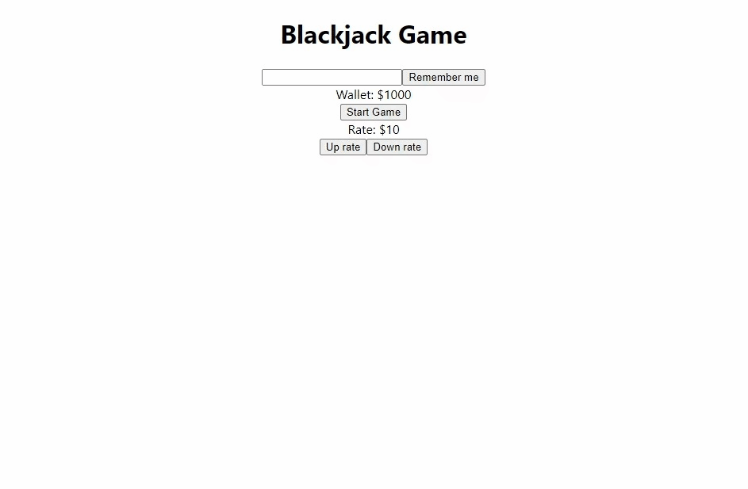

# BlackJack - Card game
It is a card game. It is the most widely played casino banking game in the world.
It uses decks of 52 cards and descends from a global family of casino banking games known as Twenty-One.

## Live Demo

### Registration and start game


### Changing rates

### Raising stakes and multiplying the minimum bet with a zero balance


### Telegram bets


### Telegram start game

## How to start

Clone the project
```
git clone https://github.com/19thanks96/blackJack_telegram-react
```

Change dir to the project folder
```
cd blackJack_telegram-react
```

### Frontend React:
```
cd frontend

npm install

npm start
```
### Backend MongoDb and Express:
Install and run MongoDb on: `mongodb://127.0.0.1:27017`
```
cd backend

npm install

npm start
```
You will see logs in `log.txt`
### Telegram bot:
To create your bot you need registration at BotFather
`https://t.me/BotFather`

```
cd backend

touch .env
```

Example of .env file:
```
export key = 'yourTelegramBotKeyAtBotFather'
```
Next step:

```
npm install

npm run bot
```
You will see logs in `log.txt`

### You can try my telegram bot at link:
```
https://t.me/BlackJackWithBetsBot
```